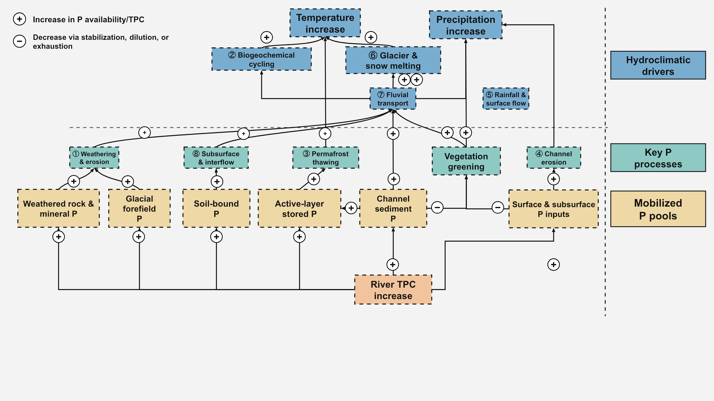
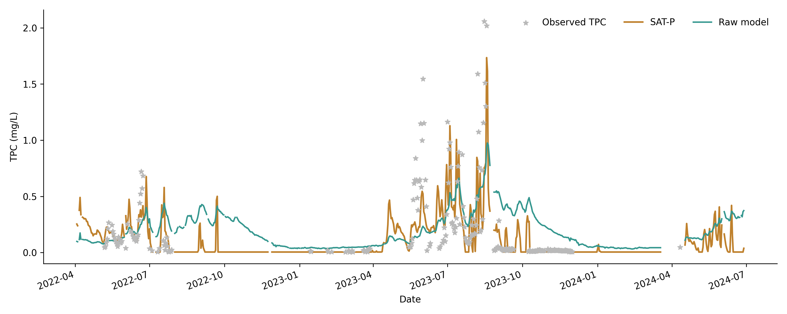

# SAT-P

SAT-P is a process-informed model for daily total phosphorus concentration (TPC) in cryosphere-fed rivers. It extends a discharge–concentration rating curve by representing thermal mobilization, rapid fluvial transport, and progressive phosphorus-storage exhaustion.

The repository accompanies the manuscript:

> Liu, G., and Li, D. *Increasing phosphorus concentrations in the cryosphere-fed river on the Tibetan Plateau: a modelling perspective*.

## Model overview

SAT-P links daily discharge to three process terms:

1. **Thermal mobilization**, represented by normalized 8-day mean air temperature;
2. **Fluvial flushing**, represented by the normalized positive 2-day discharge increase; and
3. **Storage exhaustion**, represented by a dimensionless within-year exhaustion proxy.

The implemented model is

$$
A_i=-\frac{1}{1+\exp(-GEI_i)}
$$

$$
TPC_i=A_i a_1 Q_i^{b_1T_i+b_2+1}
+A_i(a_2QI_i+b_4)Q_i^{b_3+1}
+a_3Q_i^{b_5+1},
$$

where $Q_i$ is daily discharge, $T_i$ is normalized 8-day mean temperature, $QI_i$ is normalized positive 2-day discharge increase, $GEI_i$ is the exhaustion proxy, and $a_1$–$a_3$ and $b_1$–$b_5$ are fitted parameters. The negative logistic form of $A_i$ follows the current SAT-P parameterization and should not be changed without recalibration.



## Repository contents

```text
SAT_P_GitHub/
├── src/satp/                  # Model, preprocessing, and performance metrics
├── scripts/run_demo.py        # Reproduce the demonstration simulation
├── scripts/calibrate.py       # NSGA-III multi-objective calibration
├── config/parameters.json     # Example SAT-P and raw-model parameters
├── data/demo/                 # Partial 2022–2024 demonstration dataset
├── results/                   # Reproducible demo outputs and reported metrics
├── docs/                      # Conceptual framework and model notes
└── tests/                     # Lightweight unit tests
```

## Quick start

Python 3.10 or later is recommended.

```bash
python -m venv .venv
source .venv/bin/activate
python -m pip install -e .
python scripts/run_demo.py
```

The demonstration writes:

- `results/demo_predictions.csv`
- `results/demo_metrics.json`
- `results/demo_timeseries.png`

To run a short calibration test:

```bash
python -m pip install -e ".[calibration]"
python scripts/calibrate.py --generations 100 --population 100
```

The manuscript calibration used 1,000 generations and a population size of 400:

```bash
python scripts/calibrate.py --generations 1000 --population 400
```

## Demonstration data

The public demonstration file contains 819 daily records from 3 April 2022 to 29 June 2024. It includes air temperature, precipitation, discharge, and a subset of observed TPC values. Missing observations are retained because the hydroclimatic variables are also needed to calculate rolling and cumulative predictors.

The demonstration data are only a partial dataset. They are sufficient to test the code but do not reproduce every value reported in the manuscript. See [data/README.md](data/README.md) and [data/DATA_DICTIONARY.md](data/DATA_DICTIONARY.md).

## Reported results

The manuscript reports an $R^2$ of 0.615 and an NSE of 0.613 for SAT-P, compared with an $R^2$ of 0.296 and an NSE of 0.223 for the discharge-only raw model. These manuscript-level values are recorded in [results/published_metrics.csv](results/published_metrics.csv).

Outputs generated from the partial demonstration dataset are labeled **demo results** and should not be interpreted as an independent reproduction of the complete manuscript calibration.

With the supplied example parameter set and manuscript-defined preprocessing, the demo run gives $R^2=0.545$ and NSE = 0.533 for SAT-P, compared with $R^2=0.197$ and NSE = 0.178 for the raw model. These values are regenerated in `results/demo_metrics.json`.



## Input requirements

The input CSV must contain:

- `date`: daily date;
- `temperature`: air temperature in K by default (values may also be supplied in °C with the CLI option);
- `precipitation`: daily precipitation in m water equivalent in the supplied demo;
- `discharge`: daily discharge in m³ s⁻¹; and
- `TP`: observed TPC in mg L⁻¹, which may be missing outside sampling dates.

## Reproducibility notes

- The public preprocessing follows the definitions stated in the manuscript: 8-day mean temperature and positive 2-day discharge increase.
- The current exhaustion proxy is the cumulative fraction of annual precipitation, following the supplied implementation. Alternative exhaustion formulations require recalibration.
- Calibration is stochastic. Set `--seed` for repeatable optimization runs.
- The code is research software and is not an operational water-quality forecasting system.

## Citation

If you use SAT-P, please cite the manuscript above and archive-specific citation information in [CITATION.cff](CITATION.cff). The bibliographic record can be updated after journal publication.

## Licenses

- Code: [MIT License](LICENSE)
- Demonstration data: [CC BY 4.0](DATA_LICENSE.md)
